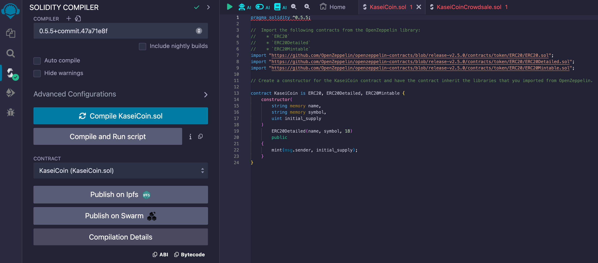

# Module 21 Challenge - Martian Token Crowdsale

## Overview
For this project I will assume the role of fintech professional developing a monetary system for a new Mars colony. The goal of the challenge is to develop a new cryptocurrency on blockchain technology named **KaseiCoin**. The currency will be a fungible token that is ERC-20 compliant and will be made available through crowdsale for the people moving to Mars to convert their earthly money to the new Martian KaseiCoin ("KAI").

## Technologies
The coin, crowdsale, and deployment contracts will be developed in the Solidity language using the Remix IDE for Ethereum and the OpenZeppelin framework and library. The transactional accounts will be tested using Ganache and the MetaMask wallet. 

* [Solidity](https://soliditylang.org/): programming language designed for developing smart contracts that run on Ethereum
* [Remix](https://remix.ethereum.org/): a native IDE for Web3 Development and deployment of smart contracts
* [Ganache](https://archive.trufflesuite.com/ganache/): a personal Ethereum blockchain which you can use to run tests, execute commands, and inspect state while controlling how the chain operates
* [MetaMask](https://metamask.io/): a popular cryptocurrency wallet and gateway to blockchain applications
* [OpenZeppelin](https://www.openzeppelin.com/): an open-source framework and library for building secure smart contracts on the Ethereum blockchain

## Application Results
Below are screenshots of the key moments in the compiling, deploying, and use of the crowdsale application to convert the existing currency to KaseiCoin ("KAI").

### MetaMask wallet with `Account 2` and `Account 3` from Ganache

### Ganache accounts linked to MetaMask

### `KaseiCoin.sol` compiled without errors

### `KaseiCoinCrowdsale.sol` compliled without errors

### KaseiCoinCrowdsaleDeployer with Ganache Account 1

<table>
  <tr>
    <td>
      
    </td>
    <td>
      
    </td>
    <td>
      
    </td>
  </tr>
</table>

### Buying Tokens for MetaMask `Account 3`

### Buying Tokens for MetaMask `Account 2`

### Ganache post-transaction blocks

### Ganache transactions

## Sources
The following sources were consulted in the completion of this project. 

* UCB FinTech Bootcamp instructor-led coding exercises

## License
[MIT License](LICENSE)